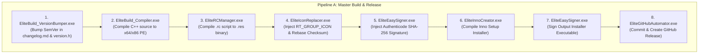
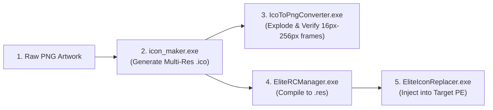

# 🔄 EliteSoftware Master Toolchain — Execution Order & Workflow Choreography

**Document Version:** 1.0.0.0  
**Target Platform:** Windows NT (Win32 / x64 & x86)  
**Standard Architecture:** Native C++ Statically Compiled Win32 CLI Binaries

---

## 🧭 1. The Dual Execution Model: User Mode vs. AI Mode

All standalone executables in the EliteSoftware Master Toolchain natively support two distinct operating modes to maximize both human developer usability and headless AI agent machine readability.

### 👤 User Mode (Default / Interactive)
* **Trigger:** Invoking the tool without the `--ai-mode` flag.
* **Console Output:** Full interactive banners, live stdout/stderr compilation logs, color-coded status messages, and progress indicators.
* **Interactive Fallbacks:** If required arguments are omitted, the tool interactively prompts the user for paths or input and validates EULA acceptance.
* **File Logging:** Automatically writes and appends all console outputs and timestamps to `%SystemDrive%\EliteSoftware\Logs\<ToolName>.log` (or `<ExeDir>\Logs\<ToolName>.log`).
* **Exit Behavior:** Prompts `Press any key to exit...` on failure to prevent console windows from abruptly closing when double-clicked in Windows Explorer.

### 🤖 AI Mode (`--ai-mode` / Headless Machine Execution)
* **Trigger:** Appending `--ai-mode` to any tool invocation, or setting system environment variable `ELITE_AI_MODE=1`.
* **Console Output:** **Completely silent on `stdout`.** Prevents terminal clutter, saves LLM context window tokens, and eliminates non-deterministic parsing issues.
* **File Logging:** **Strictly logs all execution details, child process pipes, and timestamps to the log file** (`%SystemDrive%\EliteSoftware\Logs\<ToolName>.log`).
* **Interactive Bypass:** Suppresses all EULA dialogs, interactive prompts, and `pause` calls.
* **Diagnostic Reporting:** If an error occurs, the binary outputs a structured **JSON diagnostic payload** directly to `stderr`:
  ```json
  {
    "exit_code": 11,
    "error_type": "INVALID_ARGUMENTS",
    "message": "Target source file does not exist.",
    "parameter_fault": "--source",
    "remediation": "Verify the file path exists before running EliteSymlinker.exe"
  }
  ```
* **Deterministic Return:** Returns a standardized exit code from the Unified Exit Code Taxonomy.

---

## 🛑 2. Unified Exit Code Taxonomy

All tools across the entire framework return standardized exit codes. AI agents and CI/CD pipelines must inspect process exit codes for deterministic error recovery:

| Exit Code | Constant | Error Type | Machine Interpretation & AI Remediation Action |
|:---:|:---|:---|:---|
| **0** | `ELITE_SUCCESS` | None | Execution succeeded with zero errors. Proceed to next DAG node. |
| **1** | `ELITE_ERROR_GENERAL` | `GENERAL_FAILURE` | Unspecified runtime error. Inspect `%SystemDrive%\EliteSoftware\Logs\<ToolName>.log`. |
| **10** | `ELITE_ERROR_CONFIG_MISSING` | `CONFIG_NOT_FOUND` | `.config` or JSON configuration file missing. Generate configuration stub. |
| **11** | `ELITE_ERROR_INVALID_ARGS` | `SCHEMA_VIOLATION` | Missing required flag or invalid argument syntax. Query schema and fix CLI parameters. |
| **12** | `ELITE_ERROR_FILE_NOT_FOUND` | `FILE_NOT_FOUND` | Specified input file or binary does not exist on disk. Check file topology. |
| **13** | `ELITE_ERROR_TARGET_EXISTS` | `TARGET_EXISTS` | Output file/directory already exists and overwrite flag was not supplied. |
| **20** | `ELITE_ERROR_HANDLE_LOCKED` | `RESOURCE_LOCKED` | File or directory is held open by another process. Run `EliteTaskAssassin.exe` to release handles. |
| **30** | `ELITE_ERROR_ACCESS_DENIED` | `ELEVATION_REQUIRED` | Operation requires Administrator or `NT AUTHORITY\SYSTEM`. Execute via `PsExec64Launcher.exe`. |
| **40** | `ELITE_ERROR_DEPENDENCY_MISSING` | `DEPENDENCY_MISSING` | Prerequisite toolchain (GCC, MSBuild, ISCC) missing. Run `EliteBuildLocator.exe`. |
| **50** | `ELITE_ERROR_ENV_MISSING` | `ENV_VAR_EMPTY` | Required environment variable (e.g. `ELITE_BUILD_X64`) not set. Run `EliteEnvManager.exe`. |
| **60** | `ELITE_ERROR_COMPILATION_FAILED` | `COMPILATION_FAILED` | Source code or resource compilation failed. Check compiler output in log file. |
| **70** | `ELITE_ERROR_SIGNING_FAILED` | `SIGNING_FAILED` | Authenticode signature injection failed. Verify certificate path and PE checksum. |
| **80** | `ELITE_ERROR_NETWORK_FAILED` | `NETWORK_ERROR` | Remote asset download or API endpoint unreachable. Check internet connection. |
| **90** | `ELITE_ERROR_GIT_FAILED` | `GIT_ERROR` | Git commit, tag, or push failed. Check remote repository permissions and branch lock. |
| **99** | `ELITE_ERROR_EULA_REJECTED` | `EULA_REJECTED` | Interactive EULA rejected. In AI mode, pass `--ai-mode` to bypass. |

---

## ⛓️ 3. Master Tool Execution Choreography (Workflow DAGs)

Below are the rigid Directed Acyclic Graphs (DAGs) defining the exact operational order for common software engineering tasks across the EliteSoftware ecosystem.



---

### 📦 Workflow 1: Master Build, Code-Sign, and GitHub Release Pipeline
*Use this workflow whenever compiling a project from source to a final published release.*

1. **Step 1: Synchronize & Bump Version**
   * **Tool:** `EliteBuild_VersionBumper.exe`
   * **Action:** Parses `changelog.md` and `version.h`, auto-increments the specified version segment (major, minor, feature, or bugfix), and syncs all files.
   * **AI Command:** `& "EliteBuild_VersionBumper.exe" --target "changelog.md" --bump bugfix --ai-mode`
   * **Prerequisites:** None.

2. **Step 2: Compile C++ Source Code**
   * **Tool:** `EliteBuild_Compiler.exe` (or `EliteBuild.exe`)
   * **Action:** Ingests local `.config` file or directory topology, invokes MinGW GCC / MSVC, and outputs native x64/x86 executables.
   * **AI Command:** `& "EliteBuild_Compiler.exe" --config "Build_Configurations\MyProject.config" --ai-mode`
   * **Prerequisites:** Step 1 completed.

3. **Step 3: Compile Windows Resource Scripts**
   * **Tool:** `EliteRCManager.exe`
   * **Action:** Generates standard `.rc` resource scripts containing version information, application manifests, and icon paths, then compiles them into `.res` objects using `windres.exe`.
   * **AI Command:** `& "EliteRCManager.exe" --rc "app.rc" --res "app.res" --icon "assets\app.ico" --ai-mode`
   * **Prerequisites:** Step 2 binary compiled.

4. **Step 4: Inject Icon & Rebase PE Checksum**
   * **Tool:** `EliteIconReplacer.exe` (or `ResourceAlchemyHacker_CLI.exe`)
   * **Action:** Injects the multi-resolution `RT_GROUP_ICON` into the compiled executable and immediately performs a mathematical checksum recalculation via `imagehlp.dll` (`CheckSumMappedFile`).
   * **AI Command:** `& "EliteIconReplacer.exe" --exe "x64\MyTool.exe" --icon "assets\app.ico" --ai-mode`
   * **Prerequisites:** Step 3 `.ico` resource available.

5. **Step 5: Authenticode Code Signing**
   * **Tool:** `EliteEasySigner.exe`
   * **Action:** Uses `signtool.exe` with standard certificate fallbacks (`ROOT` store or `.pfx`) to stamp a trusted SHA-256 Authenticode signature and RFC-3161 timestamp onto the binary.
   * **AI Command:** `& "EliteEasySigner.exe" --file "x64\MyTool.exe" --cert "C:\Certs\EliteMaster.cer" --ai-mode`
   * **Prerequisites:** Step 4 checksum rebase complete.

6. **Step 6: Package Inno Setup Installer**
   * **Tool:** `EliteInnoCreator.exe` (or `ElitePackager.exe`)
   * **Action:** Ingests the installation template, stages the signed binaries, and invokes `ISCC.exe` to generate a standalone Windows installer `.exe`.
   * **AI Command:** `& "EliteInnoCreator.exe" --compile "Installer\setup.iss" --ai-mode`
   * **Prerequisites:** Step 5 signed binaries ready.

7. **Step 7: Sign Installer Executable**
   * **Tool:** `EliteEasySigner.exe`
   * **Action:** Signs the generated `setup.exe` installer binary to prevent Windows SmartScreen warnings.
   * **AI Command:** `& "EliteEasySigner.exe" --file "Installer\Output\setup.exe" --ai-mode`
   * **Prerequisites:** Step 6 installer compiled.

8. **Step 8: Push Git Commit & Publish GitHub Release**
   * **Tool:** `EliteGitHubAutomator.exe`
   * **Action:** Commits all staged source changes, creates an annotated git tag matching the version bump, and publishes a GitHub release with packaged ZIPs/installers attached.
   * **AI Command:** `& "EliteGitHubAutomator.exe" release --version "1.0.2.7" --title "v1.0.2.7" --notes-file "changelog.md" --ai-mode`
   * **Prerequisites:** Step 7 complete.

---

### 🎨 Workflow 2: Multi-Resolution Icon Asset Pipeline
*Use this workflow to convert raw artwork into multi-resolution Windows icon containers and inject them.*



1. **Generate Icon Container:**
   * `& "icon_maker.exe" "assets\logo.png" "assets\logo.ico" --remove-halo --ai-mode`
2. **Verify Frame Quality (Optional):**
   * `& "IcoToPngConverter.exe" "assets\logo.ico"`
3. **Compile Resource Object:**
   * `& "EliteRCManager.exe" --rc "app.rc" --res "app.res" --icon "assets\logo.ico" --ai-mode`
4. **Inject into Target Executable:**
   * `& "EliteIconReplacer.exe" --exe "bin\app.exe" --icon "assets\logo.ico" --ai-mode`

---

### 🏗️ Workflow 3: New Repository Scaffolding Pipeline
*Use this workflow when initializing a brand new EliteSoftware project.*

1. **Initialize Git & Remote Repository:**
   * `& "EliteGitHubAutomator.exe" init --name "MyNewProject" --private --ai-mode`
2. **Generate Standard Master README:**
   * `& "EliteReadmeGenerator.exe" 1 "MyNewProject" "High-Density Win32 Engineering" --ai-mode`
3. **Link Global Build Orchestrator (Symlink Directive):**
   * `& "EliteSymlinker.exe" --source "Z:\EliteSoftware-Projects\EliteSoftware_Build-Automations\BuildOutputx64\EliteBuild.exe" --link "EliteBuild.exe" --type sym --ai-mode`
4. **Stamp Invisible Project Metadata (NTFS ADS):**
   * `& "EliteMetaStamper.exe" --dir "." --tag "EliteSoftware_ActiveProject" --ai-mode`

---

## 🛠️ 4. Quick Command Execution Reference Table

| Tool Name | Primary Purpose | User Mode Example | AI Mode Example (`--ai-mode`) |
|:---|:---|:---|:---|
| `EliteBuild.exe` | Master Entry Point & Orchestrator | `EliteBuild.exe --config build.config` | `EliteBuild.exe --config build.config --ai-mode` |
| `EliteBuild_Compiler.exe` | Native C++ Compiler Wrapper | `EliteBuild_Compiler.exe --config build.config` | `EliteBuild_Compiler.exe --config build.config --ai-mode` |
| `EliteBuild_VersionBumper.exe` | SemVer Synchronizer | `EliteBuild_VersionBumper.exe --target changelog.md --bump minor` | `EliteBuild_VersionBumper.exe --target changelog.md --bump minor --ai-mode` |
| `EliteEasySigner.exe` | Authenticode Code Signer | `EliteEasySigner.exe --file app.exe` | `EliteEasySigner.exe --file app.exe --ai-mode` |
| `EliteGitHubAutomator.exe` | Git & GitHub Release Automator | `EliteGitHubAutomator.exe commit --msg "Update"` | `EliteGitHubAutomator.exe commit --msg "Update" --ai-mode` |
| `EliteIconReplacer.exe` | RT_GROUP_ICON Injector & Checksum Rebaser | `EliteIconReplacer.exe --exe app.exe --icon app.ico` | `EliteIconReplacer.exe --exe app.exe --icon app.ico --ai-mode` |
| `EliteInnoCreator.exe` | Inno Setup Generator & Compiler | `EliteInnoCreator.exe --compile setup.iss` | `EliteInnoCreator.exe --compile setup.iss --ai-mode` |
| `ElitePackager.exe` | Release ZIP & Artifact Packager | `ElitePackager.exe --src x64 --out release.zip` | `ElitePackager.exe --src x64 --out release.zip --ai-mode` |
| `EliteRCManager.exe` | Resource Script Compiler | `EliteRCManager.exe --rc app.rc --res app.res --icon app.ico` | `EliteRCManager.exe --rc app.rc --res app.res --icon app.ico --ai-mode` |
| `EliteReadmeGenerator.exe` | Master README Template Generator | `EliteReadmeGenerator.exe 1 MyProject` | `EliteReadmeGenerator.exe 1 MyProject --ai-mode` |
| `EliteSymlinker.exe` | NTFS Symlink & Hardlink Engine | `EliteSymlinker.exe --source C:\Src --link C:\Link` | `EliteSymlinker.exe --source C:\Src --link C:\Link --ai-mode` |
| `EliteTaskAssassin.exe` | Process Killer & Handle Releaser | `EliteTaskAssassin.exe --targets "MyTool.exe"` | `EliteTaskAssassin.exe --targets "MyTool.exe" --ai-mode` |
| `icon_maker.exe` | Multi-Res .ico Converter | `icon_maker.exe image.png out.ico --remove-halo` | `icon_maker.exe image.png out.ico --remove-halo --ai-mode` |
| `ResourceAlchemyHacker_CLI.exe` | PE Resource Editor | `ResourceAlchemyHacker_CLI.exe /list app.exe` | `ResourceAlchemyHacker_CLI.exe /list app.exe --ai-mode` |

---

## 📜 5. Log Files & Verification

All tool runs record structured execution traces in:
* **Primary Path:** `%SystemDrive%\EliteSoftware\Logs\<ToolName>.log` (e.g. `C:\EliteSoftware\Logs\EliteSoftware-Compiler.log`)
* **Local Fallback:** `<ToolDirectory>\Logs\<ToolName>.log`

To inspect execution traces in PowerShell without polluting console streams:
```powershell
Get-Content -Path "$env:SystemDrive\EliteSoftware\Logs\EliteSoftware-Compiler.log" -Tail 50
```
